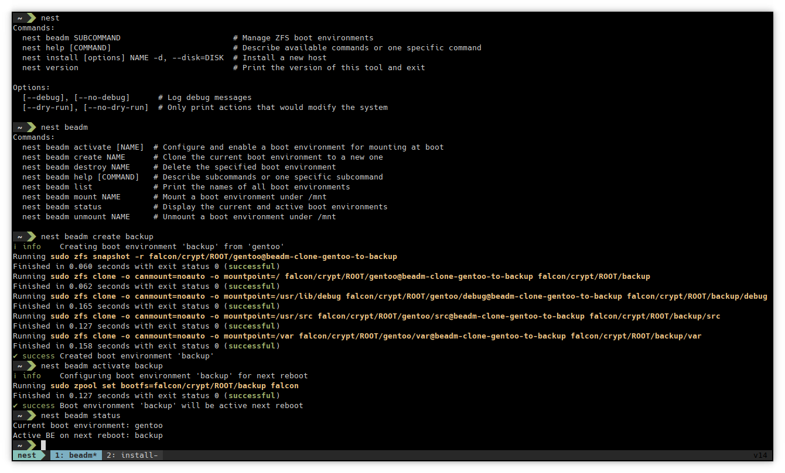
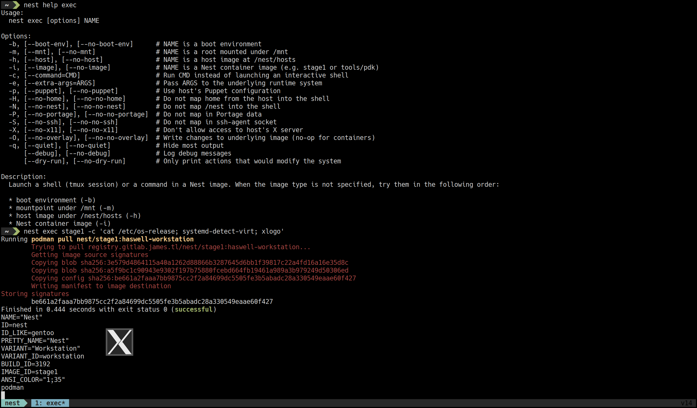
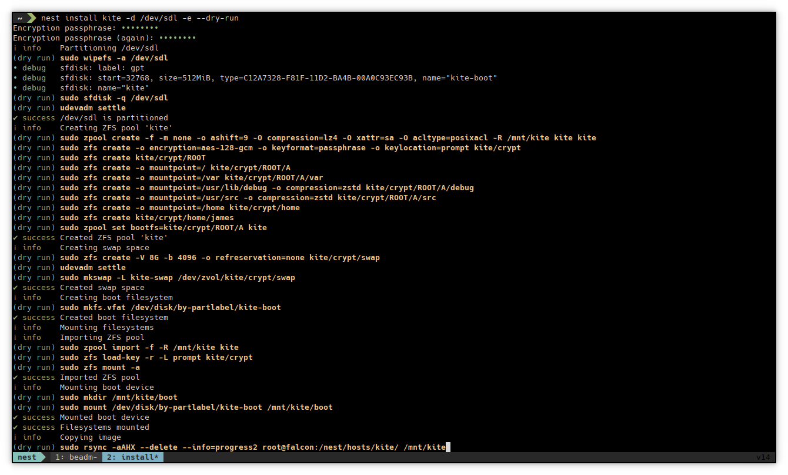
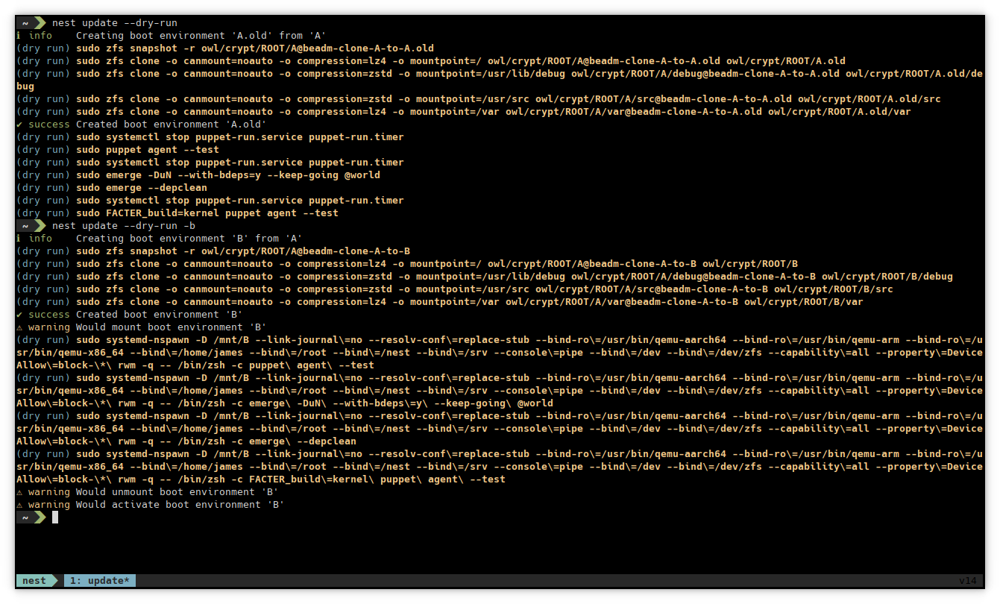

# Nest CLI

This is a collection of commands written in Ruby to install, update, and
generally administer the Nest distribution.

1. [Installation](#installation)
2. [Usage](#usage)
    * [Boot Environments](#boot-environments)
    * [Exec](#exec)
    * [Install](#install)
    * [Update](#update)
    * [Reset](#reset)
3. [Development](#development)

## Installation

[Puppet](https://gitlab.james.tl/nest/puppet/-/blob/main/manifests/base/cli.pp)
ensures the latest `app-admin/nest-cli` package from the [Nest
overlay](https://gitlab.james.tl/nest/overlay/-/tree/main/app-admin/nest-cli)
is installed.

## Usage

All commands provided by this program can be accessed by running `nest`. There
are subcommands to manage ZFS boot environments, install new hosts, update
existing hosts, and reset them back to the desired state.

| Commands                | Description                   |
|-------------------------|-------------------------------|
| `nest beadm SUBCOMMAND` | Manage ZFS boot environments  |
| `nest exec NAME`        | Run a command in a Nest image |
| `nest install NAME`     | Install a new host            |
| `nest update`           | Update hosts and images       |

### Boot Environments

`nest beadm` provides subcommands to create, destroy, mount, unmount, activate,
and query ZFS boot environments, which are clones of the OS filesystems
inspired by [the same concept in Solaris
11](https://docs.oracle.com/cd/E53394_01/html/E54749/aboutbes.html).  Boot
environments are used by the Nest installer to perform A/B seamless system
updates [similar to Android](https://source.android.com/devices/tech/ota/ab).

| Commands                     | Description                                                  |
|------------------------------|--------------------------------------------------------------|
| `nest beadm activate [NAME]` | Configure and enable a boot environment for mounting at boot |
| `nest beadm create NAME`     | Clone the current boot environment to a new one              |
| `nest beadm destroy NAME`    | Delete the specified boot environment                        |
| `nest beadm list`            | Print the names of all boot environments                     |
| `nest beadm mount NAME`      | Mount a boot environment under /mnt                          |
| `nest beadm unmount NAME`    | Unmount a boot environment under /mnt                        |
| `nest beadm status`          | Display the current and active boot environments             |

All of these commands accept a `--dry-run` argument to only print the changes
that would be made.

### Exec

`nest exec` launches a command or shell (tmux session) inside of a Nest image
using either Podman or systemd-nspawn as appropriate. It provides a uniform
interface for getting into boot environments, root disks mounted under `/mnt`,
host images from `/nest/hosts`, and Nest container images, regardless of
architecture. It maps in useful host data, such as Portage, by default.

| Options                   | Description                                                                              |
|---------------------------|------------------------------------------------------------------------------------------|
| `-b`, `--boot-env`        | The specified NAME is a boot environment                                                 |
| `-m`, `--mnt`             | The specified NAME is a root mounted under `/mnt`                                        |
| `-h`, `--host`            | The specified NAME is a host image under `/nest/hosts`                                   |
| `-i`, `--image`           | The specified NAME is a Nest container image (e.g. `stage1`)                             |
| `-c`, `--command=CMD`     | Run CMD instead of launching an interactive shell                                        |
| `-e`, `--extra-args=ARGS` | Pass ARGS to the underlying runtime system                                               |
| `-p`, `--puppet`          | Map host's Puppet configuration into container                                           |
| `-H`, `--no-home`         | Do not map homes from the host into the container                                        |
| `-N`, `--no-nest`         | Do not map `/nest` into the container                                                    |
| `-P`, `--no-portage`      | Do not map Portage data into the container                                               |
| `-S`, `--no-ssh`          | Do not map ssh-agent socket into the container                                           |
| `-X`, `--no-x11`          | Do not allow access to the host's X server                                               |
| `-O`, `--no-overlay`      | Write changes to the underlying image (no-op for boot environments and container images) |
| `-q`, `--quiet`           | Hide most output (except output produced by the command or shell)                        |
| `--debug`                 | Show debug messages (there isn't any meaningful debug output yet)                        |
| `--dry-run`               | Only print actions that would modify the system                                          |

When the image type (`-b`, `-m`, `-h`, `-i`) isn't specified, they are tried in
that order.

### Install

`nest install` is the Nest installer for hosts with a [Stage
3](https://gitlab.james.tl/nest/stage3) image. It understands everything from
partitioning to firmware installation and provides reasonable fault tolerance.

| Options                  | Description                                                                    |
|--------------------------|--------------------------------------------------------------------------------|
| `--clean`                | Just run the cleanup step                                                      |
| `-b DISK`, `--boot=DISK` | Optional boot disk to use. Enables whole disk zpool support.                   |
| `-d DISK`, `--disk=DISK` | The disk to format and install on (*e.g.* /dev/sda or /tmp/boot.iso)           |
| `-i`, `--installer`      | Create an installer for reinstalling on the target                             |
| `-e`, `--encrypt`        | Use ZFS encryption                                                             |
| `--force`                | Run cleanup actions (like `umount`) to try to correct unexpected system states |
| `-s STEP`, `--step=STEP` | Only run this installation step                                                |
| `--begin=STEP`           | The first installation step to run (default: `partition`)                      |
| `--end=STEP`             | The last installation step to run (default: `firmware`)                        |
| `--ashift=SIZE`          | Set the zpool ashift value (default: 9)                                        |
| `--debug`                | Print additional information, such as the input provided to commands           |
| `--dry-run`              | Only print actions that would modify the system                                |

The steps are self explanatory and, unless specified with `--step`, `--begin`,
or `--end` options, run in the following order:

1. `partition`
2. `format`
3. `mount`
4. `copy`
5. `bootloader`
6. `unmount`
7. `firmware`
8. `cleanup` (not run by default)

### Update

`nest update` performs a traditional package-based update with backups and
configuration management.

| Options                         | Description                                                          |
|---------------------------------|----------------------------------------------------------------------|
| `-b`, `--boot-env`              | Update the alternate boot environment                                |
| `-d DIR`, `--dir=DIR`           | Update the image mounted at DIR                                      |
| `-e ARGS`, `--extra-args=ARGS`  | Pass ARGS to the emerge update command                               |
| `-r`, `--resume`                | Skip the backup step                                                 |
| `-s STEP`, `--step=STEP`        | Only run this update step                                            |
| `--begin=STEP`                  | The first update step to run (default: `backup`)                     |
| `--end=STEP`                    | The last update step to run (default: `activate`)                    |
| `-n`, `--noop`                  | Run Puppet and Portage commands in no-op mode                        |
| `-v`, `--verbose`               | Run Portage commands with extra verbosity                            |
| `-q`, `--quiet`                 | Hide most output (except output produced by the command or shell)    |
| `--debug`                       | Print additional information, such as the input provided to commands |
| `--dry-run`                     | Only print actions that would modify the system                      |

The steps are self explanatory and, unless specified with `--step`, `--begin`,
or `--end` options, run in the following order:

1. `backup`
2. `mount`
3. `config`
4. `pre` (if `/etc/nest/pre-update.sh` exists)
5. `packages`
6. `post` (if `/etc/nest/post-update.sh` exists)
7. `reconfig`
8. `unmount`
9. `activate`

### Reset

`nest reset` resets this host from its Stage 3 image.

| Options                         | Description                                                          |
|---------------------------------|----------------------------------------------------------------------|
| `-k`, `--kernel`                | Just update the kernel                                               |
| `-f`, `--firmware`              | Just update the firmware                                             |
| `-r`, `--resume`                | Skip the backup step                                                 |
| `-s STEP`, `--step=STEP`        | Only run this update step                                            |
| `--begin=STEP`                  | The first update step to run (default: `backup`)                     |
| `--end=STEP`                    | The last update step to run (default: `activate`)                    |
| `-n`, `--noop`                  | Run Puppet and Portage commands in no-op mode                        |
| `-v`, `--verbose`               | Run Portage commands with extra verbosity                            |
| `-q`, `--quiet`                 | Hide most output (except output produced by the command or shell)    |
| `--debug`                       | Print additional information, such as the input provided to commands |
| `--dry-run`                     | Only print actions that would modify the system                      |
| `-t`, `--test`                  | Test rsync with checksums instead of times                           |

The steps are self explanatory and, unless specified with `--step`, `--begin`,
or `--end` options, run in the following order:

1. `backup`
2. `mount`
3. `sync`
5. `kernel`
8. `unmount`
9. `activate`
10. `firmware` (not run by default)

## Development

This program is developed with Bundler. Initialize the project with `bundle
install`, then make changes to code under the `lib` directory. Check the code
with `bundle exec rake` and run the CLI with `bundle exec bin/nest`.

Prepare for release by bumping `VERSION` in `lib/nest/version.rb` and create a
new Git tag followed by a [new GitLab
release](https://gitlab.james.tl/nest/cli/-/releases/new).
